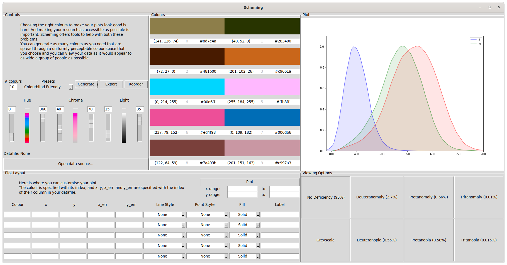
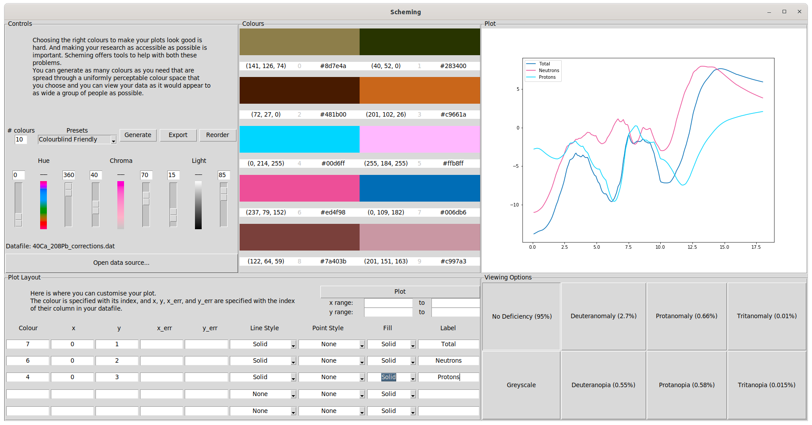
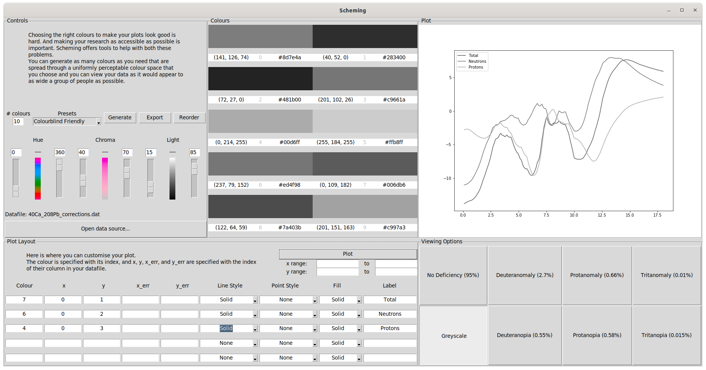
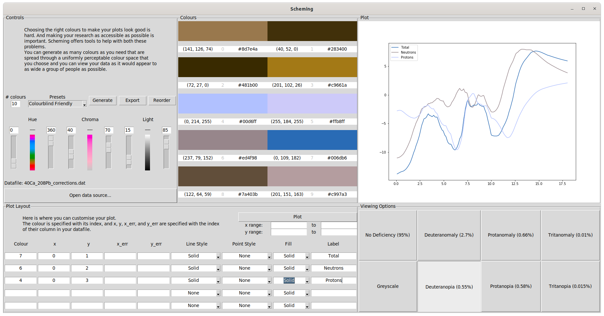
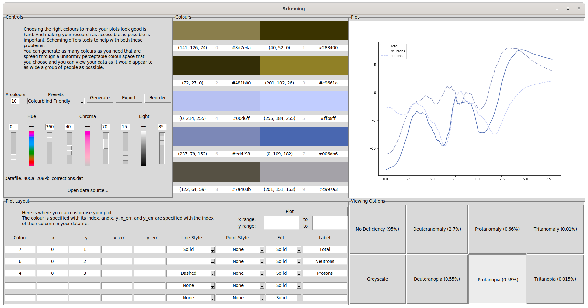

# Scheming

Choosing the right colours to make your plots look good is hard. And making your research as accessible as possible is important. **Scheming** offers tools to help with both these problems.

You can generate as many colours as you need that are spread through a uniformly perceptible colour space that you choose and you can view your data as it would appear to as wide a group of people as possible.

## Why should I use this? 

As researchers we spend a lot of time making plots, they are the basis of how we disseminate our work to the wider community. With the advent of digital journals we have the added luxury of displaying these plots in full colour and thus colour choice has become an integral part of the figure creation process. There are tools to help choice colours that both look _good_ and look _distinct_, but they often don't address the two key issues that you should consider when choosing a colour scheme. 

1. People might not have access to a full colour version, or may choose to print it without colour.
2. People do not perceive colour in the same way.

The solution to #1 is simple, ensure that your lines are distinct enough to tell apart without colour. But the solution to issue #2 is more complicated. How can we ensure that the colours we choose are distinct when they are in full colour?

**Around 5% of the population** has some form of colour deficiency, this means that on average **1 out of 20 people** that see a given plot may have difficultly separating colours which would otherwise appear distinct. This goes up to nearly **10% of the male population**. To make your work as widely accessible as possible this needs to be a consideration when choosing a colour scheme.

**Scheming** offers tools to help with this problem. Primarily, you can generate sets of random colours that are spread as widely as possible within a restricted (perceptually uniform) colour space that you choose. The default colour space is restricted to be as "Colourblind Friendly" as possible. 

Once you have a set of colours that you like, you can import a file containing some data and mock up a plot using those colours. You can then choose a _viewing experience_ to see your plot under a given colour deficiency, allowing you to make an informed decision about the accessibility of your plot.

**Scheming** includes the 6 most common forms of colour deficiency, as well as a _No Deficiency_ and _Greyscale_ mode allowing you to account for over 99.5% of the population. 

## Usage

After opening a data source you can plot the given columns using the **Plot Layout** tools. You can choose from 4 different line styles, and up to 25 distinct point types as well as the set of generated colours. You may also restrict the range of the plot. The point here is not to make a production ready plot, but to _visualise_ your data.

Once a plot has been made you are free to tweak it and to view it using the **Viewing Options** tools. 

Such as _Greyscale_, or _Deuternopia_ (lacking green colour receptors).

Using these viewing modes you can then account for a lack of visual distinction accordingly,

